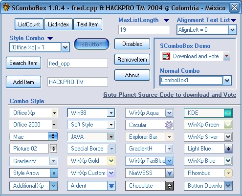



## SComboBox 1\.0\.4 Update: 2004\-09\-12

### Description

English: This control is a customizable ComboBox with multiple appearances. I hope you it like. Description: This usercontrol simulates a ComboBox.

----

But adds new an great features like: - The first ComboBox On PSC that actually works in a single file control. - When the list is shown doesn't deactivate the parent form. - More than 20 Visual Styles; no images everything done by code. - Some extra cool properties

----

----

IMPORTANT NOTE 

----

So many thanks fred_cpp for his contribution for this project, some styles and Traduction to English of some comments. All rights Reserved © HACKPRO TM 2004

----

Fixes bugs version 1.0.4

----

- ItemFocus correction.

- Clear function.

- Border Select.

- ScrollBar.

- Width Text.

- Move for the list.

- Office 2003 Appearance.

- Sub DrawAppearance.

- Sub CreateText.

----

New in this version 1.0.4 (Update: 2004-09-12)---

----

- Now if the Font change works.

- Now the temporary directory of Windows is used to manipulate the images.

- Parameter ShadowText.

- Property ListGradient.

- Function CalcTextWidth.
 
### More Info
 

             |
---                |---
**Submitted On**   |2004-09-13 06:41:46
**By**             |[Heriberto Mantilla Santamaria](https://github.com/Planet-Source-Code/PSCIndex/blob/master/ByAuthor/heriberto-mantilla-santamaria.md)
**Level**          |Advanced
**User Rating**    |4.9 (79 globes from 16 users)
**Compatibility**  |VB 5\.0, VB 6\.0
**Category**       |[Custom Controls/ Forms/  Menus](https://github.com/Planet-Source-Code/PSCIndex/blob/master/ByCategory/custom-controls-forms-menus__1-4.md)
**World**          |[Visual Basic](https://github.com/Planet-Source-Code/PSCIndex/blob/master/ByWorld/visual-basic.md)
**Archive File**   |[SComboBox\_1792939132004\.zip](https://github.com/Planet-Source-Code/heriberto-mantilla-santamaria-scombobox-1-0-4-update-2004-09-12__1-56157/archive/master.zip)

